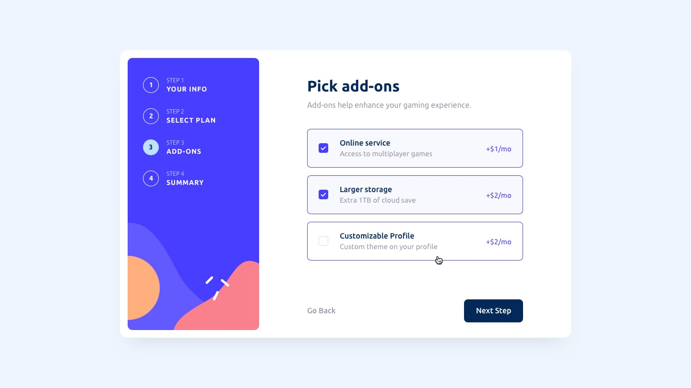
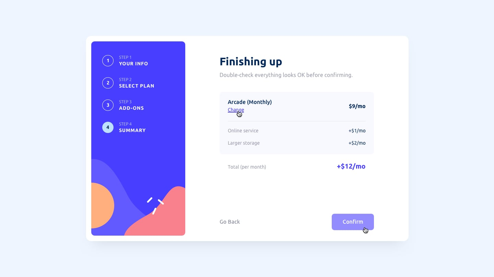

# Multi-Step Subscription Form 🚀

An interactive **multi-step subscription form** with real-time validation and a polished UX, built using **Vanilla JavaScript**, **HTML**, and **CSS**.

---

## Features ✨

- **Multi-step form** with 5 steps: Personal Info → Select Plan → Add-ons → Summary → Thank You
- **Blur-triggered validation** for inputs (Name, Email, Phone)
- **Live validation** after first blur for real-time feedback
- **Dynamic pricing** with monthly/yearly toggle
- **Add-ons selection** with live total calculation
- **Change plan** functionality on summary step
- Fully **responsive** for mobile (375px) and desktop (1440px)
- Professional **UX/UI design** with clean animations

---

## Screenshots 🖼️






> Replace the screenshots folder with actual images of your project.

---

## Tech Stack 🛠️

- **Vanilla JavaScript** (ES6+)
- **HTML5**
- **CSS3** (Flexbox & Grid)
- **Responsive design** (mobile-first)
- **Regex validation** with Touched + Live pattern

---

## Installation & Usage 💻

1. Clone the repo:

```bash
git clone https://github.com/ahmedmostafa-io/multi-step-subscription-form.git
Open index.html in your browser
Interact with the form:
Fill personal info
Choose a plan (monthly/yearly)
Select add-ons
Review summary and confirm
Folder Structure 📁
Copy code

multi-step-subscription-form/
│
├─ index.html
├─ style.css
├─ script.js
├─ images/
├─ screenshots/
└─ README.md
Author ✍️
Ahmed Mostafa Ahmed Abdel-Aal
Cairo, Egypt
🌐 [LinkedIn](https://www.linkedin.com/in/ahmed-mostafa-582378373/)

🐙 [GitHub](https://github.com/ahmedmostafa-io)
```
